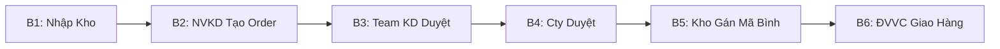

# Kế Hoạch: Hoàn Thiện Quy Trình Nhập Xuất Kho (B1 → B6)

## 1. Tổng Quan

Hoàn thiện luồng vận hành liên hoàn 6 bước từ Nhập hàng (NCC → Kho) đến Giao hàng (Kho → Khách) qua Đơn Vị Vận Chuyển, đảm bảo **nhảy số tồn kho** chính xác tại từng điểm chạm.

### Quy tắc phân quyền

> [!IMPORTANT]
> **Admin có quyền thực hiện TẤT CẢ các bước (B1→B6).** Các role khác chỉ được thao tác đúng bước của mình.

| Role | B1 Nhập Kho | B2 Tạo Order | B3 KD Duyệt | B4 Cty Duyệt | B5 Kho Gán Bình | B6 Giao Hàng |
|------|:-----------:|:------------:|:------------:|:-------------:|:---------------:|:------------:|
| **Admin** | ✅ | ✅ | ✅ | ✅ | ✅ | ✅ |
| **NVKD (sale)** | ❌ | ✅ | ❌ | ❌ | ❌ | ❌ |
| **Team KD (lead_sale)** | ❌ | ❌ | ✅ | ❌ | ❌ | ❌ |
| **Kế toán (accountant)** | ❌ | ❌ | ❌ | ✅ | ❌ | ❌ |
| **Thủ kho (thu_kho)** | ✅ | ❌ | ❌ | ❌ | ✅ | ❌ |
| **Shipper** | ❌ | ❌ | ❌ | ❌ | ❌ | ✅ |



---

## 2. Gap Analysis — Đã Có vs Cần Làm

| Bước | File/Component hiện có | Trạng thái | Thiếu gì? |
|------|----------------------|------------|------------|
| **B1** | `CreateGoodsReceipt.jsx`, `GoodsReceipts.jsx`, `schema_goods_receipts.sql` | 🟡 UI xong | ❌ Không tự cập nhật `inventory` khi duyệt phiếu nhập |
| **B2** | `CreateOrder.jsx`, `OrderFormModal.jsx` | ✅ Hoạt động | ⚠️ Cần review lại validation mobile |
| **B3** | `OrderStatusUpdater.jsx` + `ORDER_STATE_TRANSITIONS` | 🟡 Logic có | ❌ Chưa filter đơn theo role (KD chỉ thấy đơn mình) |
| **B4** | `OrderStatusUpdater.jsx` | 🟡 Logic có | ❌ Chưa có dashboard riêng cho Kế toán/Admin |
| **B5** | `OrderStatusUpdater.jsx` (gán cylinder) | 🟡 Cơ bản | ❌ Chưa cập nhật `cylinders.status` khi gán; chưa trừ inventory |
| **B6** | `Shippers.jsx`, `CylinderRecoveries.jsx` | 🟡 Quản lý ĐVVC | ❌ Chưa có BBBG workflow; NV giao không có trang công việc |

---

## 3. Task Breakdown Chi Tiết

### TS-B1: Nhập Kho Tự Động Cập Nhật Tồn Kho

**Mục tiêu:** Khi duyệt phiếu nhập (`CHO_DUYET` → `DA_NHAP`), hệ thống tự động:
1. Upsert bảng `inventory` (+quantity)
2. Insert bảng `inventory_transactions` (log nhảy số)
3. Nếu item là BINH → auto-tạo record trong bảng `cylinders` (nếu có serial)

**File cần sửa:**
- `GoodsReceipts.jsx` — Thêm nút "Duyệt nhập kho" gọi logic cập nhật
- Tạo Supabase RPC hoặc Edge Function `approve_goods_receipt`

**Schema liên quan:** `goods_receipts` → `inventory` → `inventory_transactions` → `cylinders`

---

### TS-B2: Tạo Order (NVKD) — Cải Thiện

**Mục tiêu:** Đảm bảo form tạo đơn hàng mobile-friendly, có validation đầy đủ.

**File cần review:**
- `CreateOrder.jsx` — Kiểm tra responsive mobile
- `OrderFormModal.jsx` — Validate required fields

**Ghi chú:** B2 đã hoạt động cơ bản, ưu tiên thấp hơn B1/B5/B6.

---

### TS-B3-B4: Luồng Duyệt Kép — Cải Thiện Role-Based View

**Mục tiêu:**
1. **B3:** Team KD chỉ thấy đơn của nhóm mình (`CHO_DUYET` → `CHO_CTY_DUYET`)
2. **B4:** Admin/Kế toán duyệt (`CHO_CTY_DUYET` → `KHO_XU_LY`)

**File cần sửa:**
- `Orders.jsx` — Filter orders theo `userRole` (dùng `usePermissions`)
- `OrderStatusUpdater.jsx` — Đã có `ORDER_STATE_TRANSITIONS` + `allowedRoles`, cần đảm bảo enforce đúng

**Logic hiện tại đã đúng:**
```
CHO_DUYET → CHO_CTY_DUYET (sale/admin)
CHO_CTY_DUYET → KHO_XU_LY (admin only)
KHO_XU_LY → DA_DUYET (admin/thu_kho)
```

---

### TS-B5: Kho Gán Mã Bình + Cập Nhật Tồn Kho Xuất

**Mục tiêu:** Khi thủ kho gán mã bình vào đơn (`KHO_XU_LY` → `DA_DUYET`):
1. Gán serials vào `orders.assigned_cylinders`
2. Đổi `cylinders.status` = `'đang vận chuyển'`
3. Trừ `inventory.quantity` cho kho xuất
4. Insert `inventory_transactions` (type: 'OUT')

**File cần sửa:**
- `OrderStatusUpdater.jsx` — Tại transition `KHO_XU_LY` → `DA_DUYET`:
  - Sau khi gán cylinder → gọi hàm update `cylinders.status`
  - Gọi hàm trừ `inventory`

---

### TS-B6: ĐVVC / Biên Bản Bàn Giao (BBBG) + Thu Hồi Vỏ

**Mục tiêu:** Tạo workflow hoàn chỉnh cho NV giao hàng.

**Cần tạo mới:**
- **Trang `DeliveryTasks.jsx`** — Danh sách đơn cần giao (status = `DA_DUYET` / `CHO_GIAO_HANG`)
- **Component `DeliveryConfirmModal.jsx`** — NV giao xác nhận:
  - Giao thành công → Order status = `HOAN_THANH`
  - `cylinders.status` = `'đang sử dụng'` hoặc `'thuộc khách hàng'`
  - Thu hồi vỏ rỗng → auto tạo phiếu thu hồi (`cylinder_recoveries`)

**Template in:**
- `MachineHandoverPrintTemplate.jsx` — Đã có, cần liên kết với flow BBBG

---

## 4. Thứ Tự Ưu Tiên Triển Khai

| # | Task | Độ phức tạp | Lý do ưu tiên |
|---|------|-------------|----------------|
| 1 | **B1** — Auto-update inventory khi duyệt nhập | ⭐⭐⭐ | Foundation, tất cả bước sau phụ thuộc vào tồn kho đúng |
| 2 | **B5** — Gán mã bình + trừ inventory khi xuất | ⭐⭐⭐ | Đảm bảo nhảy số chính xác khi xuất |
| 3 | **B3-B4** — Role-based filter + enforce duyệt | ⭐⭐ | Logic core đã có, cần filter UI |
| 4 | **B6** — BBBG + Giao hàng + Thu hồi | ⭐⭐⭐⭐ | Feature mới, cần tạo trang + modal mới |
| 5 | **B2** — Mobile review CreateOrder | ⭐ | Đã hoạt động, chỉ cần polish |

---

## 5. Verification Plan

- [ ] B1: Tạo phiếu nhập 10 Bình 4L → Duyệt → Kiểm tra `inventory` kho tương ứng +10
- [ ] B5: Gán 2 serial vào order → Kiểm tra `cylinders.status` = "đang vận chuyển", `inventory` -2
- [ ] B3-B4: Login role SALE → chỉ thấy nút duyệt B3; Login ADMIN → thấy B4
- [ ] B6: Shipper nhấn "Giao thành công" → Order = HOAN_THANH, cylinders = "đang sử dụng"
- [ ] E2E: Nhập 10 bình → Tạo đơn 2 bình → Duyệt → Gán → Giao → Tồn kho = 8
